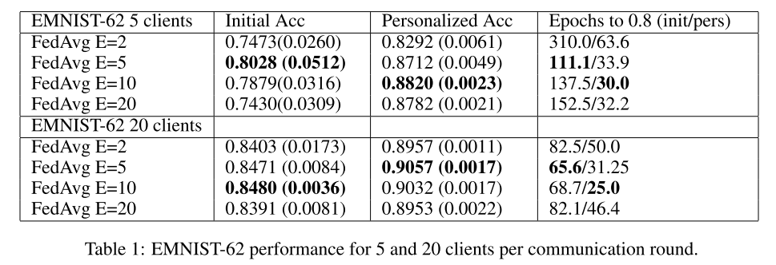

# Personalized-FedAvg

Personalized-FedAvg: [Improving Federated Learning Personalization via Model Agnostic Meta Learning](https://arxiv.org/abs/1909.12488)

## Further reading

- MAML: [Model-Agnostic Meta-Learning for Fast Adaptation of Deep Networks](https://arxiv.org/abs/1703.03400)
- Reptile: [On First-Order Meta-Learning Algorithms](https://arxiv.org/abs/1803.02999)
- LEAF: [LEAF: A Benchmark for Federated Settings](https://arxiv.org/abs/1812.01097)
## Dataset

- Experiments are run on FEMNIST(derived from [LEAF](https://github.com/TalwalkarLab/leaf))

- Download and preprocess FEMNIST:

  - `cd leaf/datasets/femnist ; sh ./preprocess.sh -s niid --iu 1.0 --sf 1.0 -k 0 -t user --tf 0.8`

    You can get more details about this command in `/leaf/datasets/femnist/README.md`.

☝ Make sure you have download and preprocess FEMNIST before running the experiment.


## Run

If you find something wrong about experiment setting, please open an issue at this repo or [PerFedAvg](https://github.com/KarhouTam/PerFedAvg). 🙏

There're two way to run experiment in **Linux**. I have already set all hyper parameters well according to paper. Of course those can be modified. You can check `utils.get_args()` for more details about all hyper parameters. 

### Single-process

```python
python single_process.py
```

### Multi-process (needs more computational power)

I have set 3 workers(process) to handle all training tasks.

```python
cd multi_process/ ; sh quick_start.sh
```


## Performance

Evaluation result after fine-tuned is shown below. 

Communication round: `500`

Fine-tune: outer loop: `100`; inner loop: `10`

Personalization round: `5`

| FedAvg local training epochs (5 clients) | Initial loss | Initial Acc | Personalized loss | Personalized Acc |
| ---------------------------------------- | ------------ | ----------- | ----------------- | ---------------- |
| 20                                       | 2.3022       | 79.35%      | 1.5766            | 84.86%           |
| 10                                       | 1.8387       | 80.53%      | 1.1231            | 87.22%           |
| 5                                        | 1.4899       | **83.19%**  | 0.9809            | **88.97%**       |
| 2                                        | 1.4613       | 81.70%      | 0.9359            | 88.49%           |

| FedAvg local training epochs (20 clients) | Initial loss | Initial Acc | Personalized loss | Personalized Acc |
| ----------------------------------------- | ------------ | ----------- | ----------------- | ---------------- |
| 20                                        | 2.2398       | 82.40%      | 0.9756            | 90.29%           |
| 10                                        | 1.6560       | **83.23**%  | 0.8488            | 90.72%           |
| 5                                         | 1.5485       | 81.48%      | 0.7452            | **90.77**%       |
| 2                                         | 1.2707       | 82.48%      | 0.7139            | 90.48%           |

Experiment result from [paper](https://arxiv.org/abs/1909.12488) is shown below



I ascribe the gap between mine and paper's results to the difference of hyper parameters setting, and I think there is no big mistake in algorithm implementation. If it actually has, please open an issue at this repo or [PerFedAvg](https://github.com/KarhouTam/PerFedAvg). 🙏  

